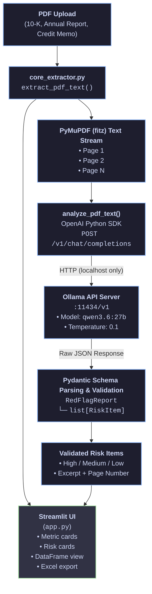

# **Local AI Financial Statement Auditor**

Automated red-flag and footnote risk extraction from financial PDFs — powered entirely by **local** large language models. No cloud APIs, no data egress, no compliance headaches.

---

## Executive Overview

Corporate finance teams routinely handle material non-public information (MNPI), audit workpapers, covenant packages, and counterparty financials bound by **NDAs**, **SOC 2** obligations, and sector-specific regulations (SOX, GDPR, M&A data rooms). Sending these documents to third-party cloud LLM providers introduces unacceptable risk: data residency violations, subprocessors outside approved jurisdictions, and audit trails that cannot satisfy internal InfoSec review.

**Local AI Financial Statement Auditor** solves this by keeping the full pipeline on-premises:

| Concern | Cloud LLM | This Project |
|---|---|---|
| Data leaves the network | Yes | **No** |
| NDA / MNPI safe | Requires legal carve-outs | **Yes — air-gapped capable** |
| Model choice | Vendor-locked | **Any Ollama-compatible model** |
| Structured output | Variable | **Pydantic-validated JSON** |
| Audit trail | Opaque | **Full local logs & Excel export** |

Upload a 10-K, annual report, or credit memo PDF. The system extracts text page-by-page, sends it to a locally hosted **Qwen 3.6** model via the Ollama OpenAI-compatible API, validates every finding against a strict schema, and presents results in an executive dashboard with exportable audit logs.

---

## System Architecture


---

## Features

- **Page-aware PDF ingestion** — PyMuPDF extracts text with `--- Page N ---` markers for accurate citation
- **Structured LLM output** — OpenAI `response_format` + Pydantic `RedFlagReport` schema enforcement
- **Risk classification** — Every finding tagged High, Medium, or Low with category, excerpt, and analysis
- **Executive dashboard** — Color-coded risk cards, live metrics, and sortable audit DataFrame
- **Export** — Download findings as a clean `.xlsx` spreadsheet for downstream review
- **Configurable runtime** — Swap models and API endpoints from the sidebar without code changes

---

## Project Structure

```
financial-redflag-extractor/
├── app.py              # Streamlit web interface
├── core_extractor.py   # PDF ingestion, LLM analysis, Pydantic schemas
├── requirements.txt    # Python dependencies
└── README.md
```

---

## Installation (Linux)

### Prerequisites

- Python 3.11 or later
- [Ollama](https://ollama.com) installed and running
- Sufficient GPU VRAM for `qwen3.6:27b` (≈16 GB+) or a smaller quantised variant

### Step 1 — Install Ollama

```bash
curl -fsSL https://ollama.com/install.sh | sh
```

Verify the daemon is running:

```bash
systemctl status ollama
# or start manually:
ollama serve
```

### Step 2 — Pull the Qwen model

```bash
ollama pull qwen3.6:27b
```

Confirm the model is available:

```bash
ollama list
curl http://localhost:11434/v1/models
```

### Step 3 — Clone the repository

```bash
git clone https://github.com/<your-org>/financial-redflag-extractor.git
cd financial-redflag-extractor
```

### Step 4 — Create a virtual environment

```bash
python3 -m venv .venv
source .venv/bin/activate
```

### Step 5 — Install Python dependencies

```bash
pip install --upgrade pip
pip install -r requirements.txt
```

### Step 6 — Launch the application

```bash
streamlit run app.py
```

Open the URL printed in the terminal (default: `http://localhost:8501`).

### Step 7 — Run your first audit

1. Upload a financial PDF via the sidebar
2. Confirm the API base URL is `http://localhost:11434/v1`
3. Select **qwen3.6:27b** from the model dropdown
4. Review flagged items in the **Visual Executive Summary** tab
5. Export results from **Raw Audit Logs (Dataframe)**

---

## Sample Output Schema

Every analysis returns a validated `RedFlagReport` JSON object:

```json
{
  "risk_items": [
    {
      "category": "Going Concern",
      "flag_title": "Substantial Doubt About Ability to Continue",
      "risk_level": "High",
      "excerpt": "The accompanying consolidated financial statements have been prepared assuming the Company will continue as a going concern. As of December 31, 2025, the Company had accumulated deficits of $142.3 million and negative working capital of $28.7 million.",
      "analysis": "Management explicitly raises going-concern uncertainty. Accumulated deficits combined with negative working capital indicate severe liquidity stress. Covenant breaches or inability to refinance maturing debt within 12 months would trigger default.",
      "page_number": 47
    },
    {
      "category": "Related-Party Transactions",
      "flag_title": "Undisclosed Related-Party Lease Arrangement",
      "risk_level": "Medium",
      "excerpt": "The Company leases its headquarters facility from an entity wholly owned by the Chief Executive Officer. Annual rent expense totalled $3.2 million for the year ended December 31, 2025.",
      "analysis": "Related-party lease with the CEO creates potential conflicts of interest. Rent appears above market rate relative to comparable Class-A office space in the region. Independent board review and third-party valuation recommended.",
      "page_number": 82
    },
    {
      "category": "Revenue Recognition",
      "flag_title": "Aggressive Channel-Stuffing Indicators",
      "risk_level": "Low",
      "excerpt": "Days sales outstanding increased from 42 days to 67 days year-over-year, while revenue grew 18% in Q4 relative to prior quarters.",
      "analysis": "DSO deterioration alongside Q4 revenue acceleration may indicate channel stuffing or premature revenue recognition. Trend warrants further scrutiny of Q4 shipment and return patterns.",
      "page_number": 31
    }
  ]
}
```

### Schema Reference

| Field | Type | Description |
|---|---|---|
| `risk_items` | `array` | List of identified red flags |
| `risk_items[].category` | `string` | Risk domain (e.g. Liquidity, Governance) |
| `risk_items[].flag_title` | `string` | Short descriptive title |
| `risk_items[].risk_level` | `"High" \| "Medium" \| "Low"` | Severity classification |
| `risk_items[].excerpt` | `string` | Verbatim quote from the source document |
| `risk_items[].analysis` | `string` | Analyst narrative explaining the concern |
| `risk_items[].page_number` | `integer` | 1-indexed page reference (≥ 1) |

---

## Configuration

| Parameter | Default | Location |
|---|---|---|
| API base URL | `http://localhost:11434/v1` | Sidebar / `DEFAULT_BASE_URL` in `core_extractor.py` |
| Model | `qwen3.6:27b` | Sidebar / `DEFAULT_MODEL` in `core_extractor.py` |
| Temperature | `0.1` | `core_extractor.py` (deterministic extraction) |
| Max tokens | `6144` | `core_extractor.py` |

---

## Troubleshooting

**`Could not reach local API at http://localhost:11434/v1`**
Ensure Ollama is running: `ollama serve` or `systemctl start ollama`.

**Model not found**
Pull the model first: `ollama pull qwen3.6:27b`.

**Empty or invalid JSON from model**
Try a smaller context window by splitting large PDFs, or switch to a model with stronger JSON adherence.

**PDF contains no extractable text**
The document may be image-only (scanned). OCR preprocessing is not included in this release.

---

## License

MIT — see repository for details.

---

## Disclaimer

This tool assists human review; it does not constitute financial, legal, or audit advice. All findings must be validated by qualified professionals before reliance in credit, investment, or regulatory decisions.
