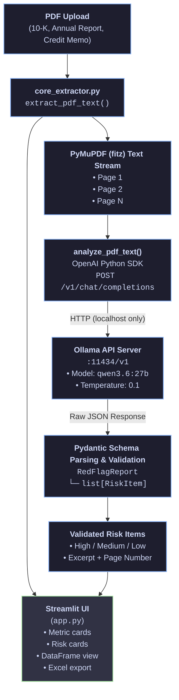

# Local AI Financial Statement & Disclosure Risk Auditor

An independent Python project exploring how **locally hosted language models can support financial statement review** while keeping source evidence traceable.

The application analyses financial PDFs for potential disclosure risks across areas such as **liquidity, debt, governance, related-party transactions and revenue recognition**, returning structured findings alongside the supporting excerpt and page reference for human verification.

Rather than treating the LLM as the final analyst, the project is designed around a simple principle: **AI can accelerate document review, but the underlying evidence should remain visible and auditable.**

---

## What the Application Does

1. Extracts financial-report text page-by-page using **PyMuPDF**.
2. Sends extracted text to a **locally hosted LLM through Ollama**, avoiding the need to transmit the document to an external LLM API.
3. Uses **Pydantic schemas** to enforce structured outputs.
4. Identifies and classifies potential financial and disclosure risks by category and severity.
5. Returns the **source excerpt and page number** alongside each finding so the user can verify it against the original document.
6. Presents results through a **Streamlit dashboard** and exports structured findings to Excel.

> **Project type:** Independent personal project  
> **Tools:** Python, PyMuPDF, Pydantic, Ollama, Streamlit, Pandas, OpenAI-compatible local API

---

## Why I Built It

When analysing an annual report, much of the time is spent locating and organising potentially relevant information before deciding whether it actually matters.

I wanted to explore whether a local LLM could help with that first stage without turning the model into a black-box decision maker.

The main challenge was therefore not simply getting an LLM to summarise a financial report. I wanted the output to be:

- **structured**, so findings could be compared and exported;
- **traceable**, so each finding could be checked against the source;
- **locally processed**, so the workflow did not depend on sending the document to an external LLM API; and
- **human-reviewed**, so classification by the model was treated as a prompt for further analysis rather than a definitive conclusion.

This led to the page-aware extraction and validation workflow used in the application.

## System Architecture


---

## Features

- **Page-aware PDF ingestion** — PyMuPDF preserves page boundaries so findings can be traced back to their source
- **Structured LLM output** — Pydantic `RedFlagReport` schemas enforce a consistent output structure
- **Preliminary risk classification** — Potential findings are categorised by severity, category and rationale to help prioritise human review
- **Source traceability** — Each finding retains the supporting excerpt and page reference for verification against the original document
- **Interactive dashboard** — Streamlit interface with summary metrics, risk cards and a sortable findings table
- **Excel export** — Structured findings can be exported to `.xlsx` for further analysis or review
- **Configurable local inference** — Models and API endpoints can be changed from the interface without modifying the underlying code

---

## Project Structure

```
financial-redflag-extractor/
├── app.py              # Streamlit web interface
├── core_extractor.py   # PDF ingestion, LLM analysis, Pydantic schemas
├── requirements.txt    # Python dependencies
└── README.md
```

---

## Installation (Linux)

### Prerequisites

- Python 3.11 or later
- [Ollama](https://ollama.com) installed and running
- Sufficient GPU VRAM for `qwen3.6:27b` (≈16 GB+) or a smaller quantised variant

### Step 1 — Install Ollama

```bash
curl -fsSL https://ollama.com/install.sh | sh
```

Verify the daemon is running:

```bash
systemctl status ollama
# or start manually:
ollama serve
```

### Step 2 — Pull the Qwen model

```bash
ollama pull qwen3.6:27b
```

Confirm the model is available:

```bash
ollama list
curl http://localhost:11434/v1/models
```

### Step 3 — Clone the repository

```bash
git clone https://github.com/<your-org>/financial-redflag-extractor.git
cd financial-redflag-extractor
```

### Step 4 — Create a virtual environment

```bash
python3 -m venv .venv
source .venv/bin/activate
```

### Step 5 — Install Python dependencies

```bash
pip install --upgrade pip
pip install -r requirements.txt
```

### Step 6 — Launch the application

```bash
streamlit run app.py
```

Open the URL printed in the terminal (default: `http://localhost:8501`).

### Step 7 — Run your first audit

1. Upload a financial PDF via the sidebar
2. Confirm the API base URL is `http://localhost:11434/v1`
3. Select **qwen3.6:27b** from the model dropdown
4. Review flagged items in the **Visual Executive Summary** tab
5. Export results from **Raw Audit Logs (Dataframe)**

---

## Sample Output Schema

The example below illustrates the structure of a `RedFlagReport` returned by the application. The findings are deliberately framed as issues for further investigation rather than definitive conclusions.

```json
{
  "risk_items": [
    {
      "category": "Going Concern",
      "flag_title": "Going-Concern Uncertainty",
      "risk_level": "High",
      "excerpt": "The accompanying consolidated financial statements have been prepared assuming the Company will continue as a going concern. As of December 31, 2025, the Company had accumulated deficits of $142.3 million and negative working capital of $28.7 million.",
      "analysis": "The disclosure explicitly raises going-concern uncertainty, while the accumulated deficit and negative working capital indicate material financial pressure. Further review should consider available liquidity, debt maturities, covenant headroom and management's financing plans.",
      "page_number": 47
    },
    {
      "category": "Related-Party Transactions",
      "flag_title": "CEO-Linked Related-Party Lease",
      "risk_level": "Medium",
      "excerpt": "The Company leases its headquarters facility from an entity wholly owned by the Chief Executive Officer. Annual rent expense totalled $3.2 million for the year ended December 31, 2025.",
      "analysis": "The lease involves an entity owned by the CEO, creating a potential related-party conflict that warrants review. The excerpt alone does not establish whether the lease terms are above or below market rates, so further analysis would be required before drawing that conclusion.",
      "page_number": 82
    },
    {
      "category": "Revenue Recognition",
      "flag_title": "Revenue Recognition Review Indicator",
      "risk_level": "Low",
      "excerpt": "Days sales outstanding increased from 42 days to 67 days year-over-year, while revenue grew 18% in Q4 relative to prior quarters.",
      "analysis": "The combination of higher DSO and stronger Q4 revenue may warrant further review of revenue recognition, shipment timing, receivables and returns. The information provided is not sufficient on its own to conclude that aggressive revenue recognition has occurred.",
      "page_number": 31
    }
  ]
}
```

### Schema Reference

| Field                      | Type                           | Description                                                     |
| -------------------------- | ------------------------------ | --------------------------------------------------------------- |
| `risk_items`               | `array`                        | List of potential findings identified for review                |
| `risk_items[].category`    | `string`                       | Financial or disclosure risk category                           |
| `risk_items[].flag_title`  | `string`                       | Short description of the potential issue                        |
| `risk_items[].risk_level`  | `"High" \| "Medium" \| "Low"` | Preliminary severity classification used to prioritise review   |
| `risk_items[].excerpt`     | `string`                       | Supporting excerpt retained from the source document            |
| `risk_items[].analysis`    | `string`                       | LLM-generated rationale explaining why the finding may matter   |
| `risk_items[].page_number` | `integer`                      | Page reference used to trace the finding to the source document |

---

## Configuration

| Parameter | Default | Location |
|---|---|---|
| API base URL | `http://localhost:11434/v1` | Sidebar / `DEFAULT_BASE_URL` in `core_extractor.py` |
| Model | `qwen3.6:27b` | Sidebar / `DEFAULT_MODEL` in `core_extractor.py` |
| Temperature | `0.1` | `core_extractor.py` (deterministic extraction) |
| Max tokens | `6144` | `core_extractor.py` |

---

## Troubleshooting

**`Could not reach local API at http://localhost:11434/v1`**
Ensure Ollama is running: `ollama serve` or `systemctl start ollama`.

**Model not found**
Pull the model first: `ollama pull qwen3.6:27b`.

**Empty or invalid JSON from model**
Try a smaller context window by splitting large PDFs, or switch to a model with stronger JSON adherence.

**PDF contains no extractable text**
The document may be image-only (scanned). OCR preprocessing is not included in this release.

---

## License

MIT — see repository for details.

---
## Limitations

This project is designed to **support, not replace, human financial analysis**.

LLM-generated findings, severity classifications and commentary may be incomplete or incorrect. A flagged item should therefore be treated as a prompt for further investigation rather than evidence that a financial, accounting or governance issue exists.

Source excerpts and page references are retained specifically so findings can be checked against the original document before being relied upon. The quality of the analysis also depends on the quality of the extracted PDF text and the capabilities of the selected local model.

The current version does not include OCR preprocessing for image-only PDFs and has not been validated for production credit, investment, audit, legal or regulatory use.

This is an **independent personal project** developed to explore the application of local AI to financial-document analysis.
